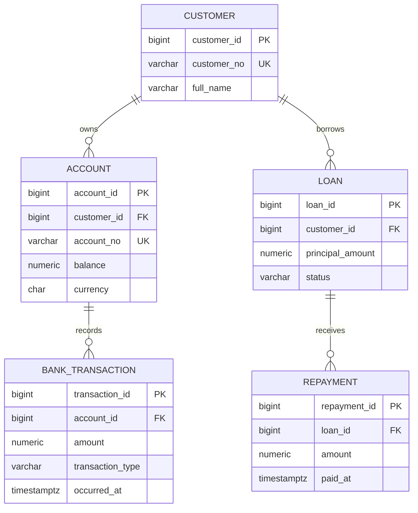

# 银行业务 ER 图

## 1. 业务范围

本项目围绕客户、账户、交易、贷款和还款五类核心业务数据建立关系模型。

## 2. 实体关系

```mermaid
erDiagram
    CUSTOMER ||--o{ ACCOUNT : owns
    ACCOUNT ||--o{ BANK_TRANSACTION : records
    CUSTOMER ||--o{ LOAN : borrows
    LOAN ||--o{ REPAYMENT : receives

    CUSTOMER {
        bigint customer_id PK
        varchar customer_no UK
        varchar full_name
    }

    ACCOUNT {
        bigint account_id PK
        bigint customer_id FK
        varchar account_no UK
        numeric balance
        char currency
    }

    BANK_TRANSACTION {
        bigint transaction_id PK
        bigint account_id FK
        numeric amount
        varchar transaction_type
        timestamptz occurred_at
    }

    LOAN {
        bigint loan_id PK
        bigint customer_id FK
        numeric principal_amount
        varchar status
    }

    REPAYMENT {
        bigint repayment_id PK
        bigint loan_id FK
        numeric amount
        timestamptz paid_at
    }
```

## 3. 关系说明

- 一个客户可以拥有多个账户。
- 一个账户可以关联多笔交易。
- 一个客户可以拥有多笔贷款。
- 一笔贷款可以对应多笔还款。

当前版本假设一个账户只属于一个客户；
如需支持联名账户，后续可增加账户持有人关联表。
